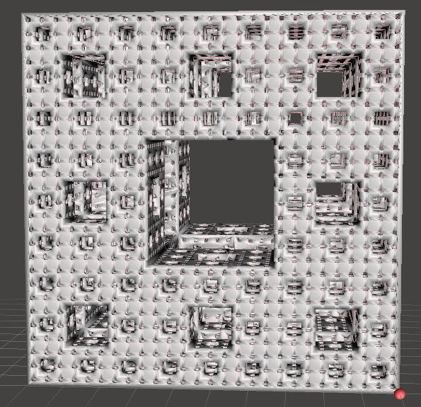

# Menger sponge
3d fractal generator pymesh stl python script  
Change depth variable to set iteration level
### Instruction
To compute 2th iteration sponge, run:
```
sh run.sh 2
```
Then get stl file from:
```
./portal/
```
### Menger sponge fractal
https://en.wikipedia.org/wiki/Menger_sponge
### PyMesh library
https://pymesh.readthedocs.io
### PyMesh examples
https://github.com/gaoyue17/PyMesh/tree/master/python/pymesh
### Result of 4th iteration sponge

### Performance
Computer specifications  
```
Intel(R) Core(TM) i3-7350K CPU @ 4.20GHz (4 cores)
39 GB RAM (17 used)
Ubuntu 20
```
3th iteration. 4 MB stl file
```
2021.06.20 10:44:48 sponge a generation complete
2021.06.20 10:44:48 rotate b
2021.06.20 10:44:48 trans b
2021.06.20 10:44:48 rotate c
2021.06.20 10:44:48 trans c
2021.06.20 10:44:48 union u = a + b
2021.06.20 10:45:25 union u = u + c
2021.06.20 10:46:55 difference fractal - u
2021.06.20 10:47:33 saving..
2021.06.20 10:47:33 job complete
```
4th iteration. 72.7 MB stl file
```
2021.06.20 10:53:26 0/4 iteration
2021.06.20 10:53:26 1/4 iteration
2021.06.20 10:53:26 2/4 iteration
2021.06.20 10:53:40 3/4 iteration
2021.06.20 11:23:11 sponge a generation complete
2021.06.20 11:23:11 rotate b
2021.06.20 11:23:11 trans b
2021.06.20 11:23:11 rotate c
2021.06.20 11:23:11 trans c
2021.06.20 11:23:11 union u = a + b
2021.06.20 11:41:57 union u = u + c
2021.06.20 12:24:15 difference fractal - u
2021.06.20 12:36:12 saving..
2021.06.20 12:36:19 job complete
```
